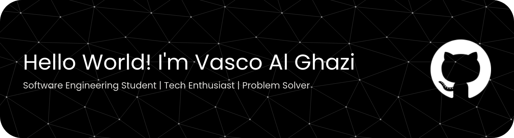

# Helllo World!! Im' Vasco 

  

  
  
  
  

---

## 👨‍🎓 About Me

**Vasco** — Mahasiswa Teknik jurusan **Sistem Teknologi dan Informasi**.  
Full-stack developer yang menguasai C, React, database, dan mobile development. Selalu grinding code dari kampus sampai malam. [web:1]

| 🔭 Currently | 🌱 Learning More | 🎯 Goals |
|:------------:|:----------------:|:---------|
| Full-stack projects | Advanced algorithms | Software Engineer Pro |
| React & mobile apps | System architecture | Build production apps |
| Database optimization | DevOps & deployment | Contribute open source | 

---

## 🛠️ Tech Stack (Expert Level)

  

**Core Skills:**  
`C` • `React JS` • `PostgreSQL` • `MySQL` • `Express JS`  
`Tailwind CSS` • `Flutter` • `Kotlin` • `Python` 

---
